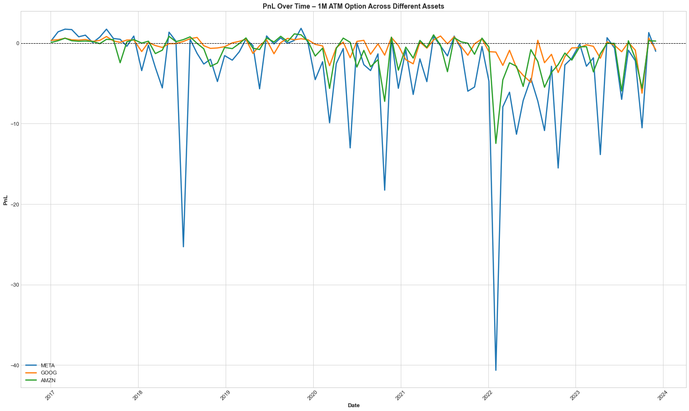

# An Assessment of the Effectiveness of Daily Delta Hedging w/ Black-Scholes for Writers of European Option Contracts

## Brief Overview

Market-making financial institutions that sell option contracts seek to neutralise their exposure to market movements and instead earn structural revenues (e.g., bid-ask spreads). **Delta-Hedging**, which entails holding the exact amount of shares required to offset changes in the value of the payoff, is a strategy typically employed to reduce directional exposure. However, delta-hedging itself faces multiple sources of error. Most significantly:

### Error Source: Model Error

The amount of shares held, **Δ**, in a delta-hedging strategy is computed based on a mathematical model of the option price. Mathematical models are rarely fully representative of reality. As such, there is error associated with the difference in how the **MODEL** values the option vs. the **REAL** valuation. For instance, the Black–Scholes model employed in this circumstance assumes constant volatility of the underlying asset where, in reality, the volatility of the asset may vary significantly with time, leading to a misvaluation of the option's **Δ** and hence an erroneous hedge.

### Error Source: Gamma Error

The delta hedge is rebalanced at **discrete times**. The discrete nature of the rebalancing procedure gives rise to hedging error associated with failure to capture the convexity of the option's value with respect to the underlying price. By employing Taylor Series expansions, the exposure of the portfolio due to the discrete nature of the rebalancing can be seen to be a function of **Γ**, the convexity, in the equation below (see LateX document for full derivation).

  

## Project Aims

1. This project determines the effectiveness of daily delta-hedging across a variety of option contract types (varied by moneyness and time to maturity) by measuring the mean PnL achieved by employing the strategy across historical data ranging from 2017 to 2024. This serves to inform the contracts types where Black-Scholes-based daily delta-hedging is sufficient and where it falls short. 

2. The project also diagnoses which of the primary error sources dominate by considering where the primary sources of error are greatest. Diagnosis of the driving error serves to inform what correction strategies ought to be employed for a more effective delta hedge. 

  

## Results & Insights

This section visualises the hedging performance of Black-Scholes-based delta hedging strategies across varying contract types.

### 📈 Mean PnL Surface

  

Shows average PnL over all simulations. Negative values indicate consistent losses due to model or rebalancing error.

---

### 📊 Standard Deviation of PnL

  

Visualises variability of hedging outcomes. Higher standard deviation implies greater PnL risk.

---

### 💸 Volatility Premium

  

Volatility premium calculated as:  
<strong>−mean(PnL) + risk_aversion × std(PnL)</strong>.  
Higher premiums suggest markets where hedging is riskier and costlier.

---

### 🧮 Volatility Mispricing

  

Displays average pricing difference between Black-Scholes and pricing under realised volatility — a measure of model error.

---

### 📐 Gamma Error Surface

  

Gamma error arises from discrete hedging in convex payoff structures. Peaks around ATM, long-dated options.

---

### ⏱️ PnL Over Time by Asset

  

Hedging PnL over time for META, GOOG, and AMZN long-dated ATM calls. Deviations indicate macro-driven risk or structural model misspecification.

## Conclusions & Summarisations

## 📁 Market Data Format Requirements

For the code to work, the market data must be stored specifically as highlighted:

1. A separate '.csv' file for each asset - saved as "{TICKER}_Data.csv" (e.g., `META_Data.csv`, `GOOG_Data.csv`)
2. Each .csv file must contain data sampled at **daily frequency** only. The implementation does not support intraday, weekly, or monthly data.
3. The data must contain only trading days. 
4. The data must have exactly the same format as shown in the sample below. 
5. Files must be stored in a local path.

## Caveats

Input to Moneyness must be symmetrical about 1
File Path to be changed. 
**Sample Market Data Format**:

  

