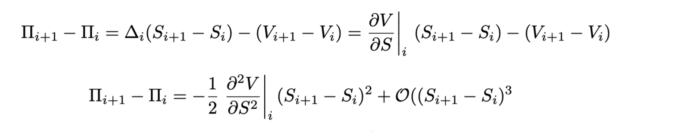

# An Assessment of the Effectiveness of Daily Delta Hedging w/ Black-Scholes for Writers of European Option Contracts

## Brief Overview

Market-making financial institutions that sell option contracts seek to neutralise their exposure to market movements and instead earn structural revenues (e.g., bid-ask spreads). **Delta-Hedging**, which entails holding the exact amount of shares required to offset changes in the value of the payoff, is a strategy typically employed to reduce directional exposure. However, delta-hedging itself faces multiple sources of error. Most significantly:

### Error Source: Model Error

The amount of shares held, **Δ**, in a delta-hedging strategy is computed based on a mathematical model of the option price. Mathematical models are rarely fully representative of reality. As such, there is error associated with the difference in how the **MODEL** values the option vs. the **REAL** valuation. For instance, the Black–Scholes model employed in this circumstance assumes constant volatility of the underlying asset where, in reality, the volatility of the asset may vary significantly with time, leading to a misvaluation of the option's **Δ** and hence an erroneous hedge.

### Error Source: Gamma Error

The delta hedge is rebalanced at **discrete times**. The discrete nature of the rebalancing procedure gives rise to hedging error associated with failure to capture the convexity of the option's value with respect to the underlying price. By employing Taylor Series expansions, the exposure of the portfolio due to the discrete nature of the rebalancing can be seen to be a function of **Γ**, the convexity, in the equation below (see LateX document for full derivation).

  

## Project Aims

1. This project determines the effectiveness of daily delta-hedging across a variety of option contract types (varied by moneyness and time to maturity) by measuring the mean PnL achieved by employing the strategy across historical data ranging from 2017 to 2024. This serves to inform the contracts types where Black-Scholes-based daily delta-hedging is sufficient and where it falls short. 

2. The project also diagnoses which of the primary error sources dominate by considering where the primary sources of error are greatest. Diagnosis of the driving error serves to inform what correction strategies ought to be employed for a more effective delta hedge.

3. As an extension, the project will also simulate the delta-hedge by employing the Heston stochastic vol. valuation in order to compare the effectiveness of these different models in delta-hedging.
   

  

## Results

### Mean PnL Surface

  

---

###  Mean PnL Surface (Alternative View)

  

---

###  Standard Deviation of PnL

  

---

###  Volatility Premium

  

Volatility premium calculated as:  
<strong>−mean(PnL) + risk_aversion × std(PnL)</strong>.  

---

###  Volatility Mispricing

  

---

###  Gamma Error Surface

  

---

## Conclusions & Summarisations

### Observations

The delta-hedge is clearly the most effective for short-dated options that are far ITM or OTM as PnL suffers the least then. The effectiveness of delta-hedging drops with both 
increasing time to maturity and moneyness tending to 1 - although it increases at a greater rate with time to maturity. 

### Explanation of Observations - Effectiveness vs. Time to Maturity

With a longer time to maturity, more error has a chance to accumulate. The mispricing of the option's delta over longer periods of time leads to compounding portfolio exposure for longer periods
of time - which can accumulate and lead to greater PnL deviation. Similarly, the gamma error can also accumulate over long periods of time - with the compounding effect causing it to be of greater
detriment than for short-dated options. 

As well as increasing error accumulation, the volatility mispricing itself is amplified with longer maturity. Not only is volatility mispricing's impact of delta compounded over time, the volatility is mispriced to a 
greater extent - as seen by the volatility mispricing surface showcasing a larger deviation with time. As more time elapses, the volatility of the underlying is more likely to experience changes so with long-dated options, they are more likely to suffer from mispricing eventually - causing large deviations. 

SHOW FIGS OF EQUATIONS

### Improvements - Effectiveness vs. Time to Maturity

As such, when delta-hedging with longer-dated contracts, it would be do well to use a stochastic volatility model (such as the Heston Model) - where the volatility is a variable. This may serve to capture the variation of the volatility in the market better and improve the quality of the hedge. 

With gamma error also accumulating over time, rebalancing more frequently to drive down gamma error may also help - although it is important to note that rebalancing frequencies may be constrained by transacation costs. 

### Explanation of Observations - Effectiveness vs. ATM

Nearing the money, it can also be seen that the error grows. This is because, near the money, the convexity of the option's price is much higher. As such, the discretisation error is amplified. 

### Conclusion - Effectiveness vs. Time to Maturity

With gamma error being very large for ATM options, a natural remedy is therefore to rebalance the delta-hedge more frequently to reduce the gamma error. However, again, this may be subjected to constraints. 

  

  

## Extras: Market Data Format Requirements

For the code to work, the market data must be stored and handled specifically as highlighted:

1. A separate '.csv' file for each asset - saved as "{TICKER}_Data.csv" (e.g., `META_Data.csv`, `GOOG_Data.csv`)
2. Each .csv file must contain data sampled at **daily frequency** only. The implementation does not support intraday, weekly, or monthly data.
3. The data must contain only trading days. 
4. The data must have exactly the same format as shown in the sample below. 
5. Files must be stored in a local path.
6. Input to Moneyness must be symmetrical about an ATM option (for example, if choosing a high of 1.3, choose a low of 0.7)

**Sample Market Data Format**:

  

